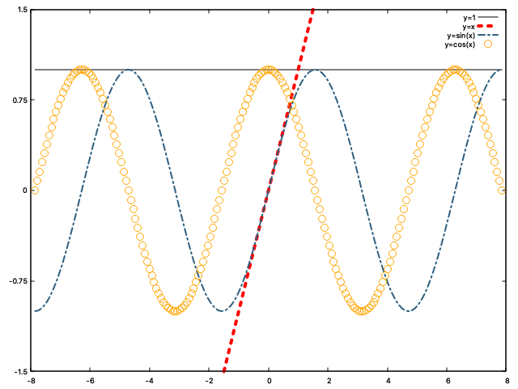

## 002 - FigureProperties example

This example highlights the properties that can be modified for a figure and how to configure them.

This is the list of properties:
* `Color`: An enum type indicating the line, marker or surface colour. By default, it is black, the detailed list 
of available colours can be found [here](https://github.com/Qnubo-Tech/SharpPlot/blob/master/SharpPlot/Utils/Color.cs). 
* `DashType`: An enum type specifying the line type. By default, it is solid, the different dash patterns 
are [here](https://github.com/Qnubo-Tech/SharpPlot/blob/master/SharpPlot/Utils/DashType.cs).
* `Marker`: An enum type containing the point type or shape. By default, it is a coloured circle, the markers set 
can be found [here](https://github.com/Qnubo-Tech/SharpPlot/blob/master/SharpPlot/Utils/Marker.cs). 
* `Size`: A double type that sets the point size. By default is 1.0, it must be greater than zero.
* `Title`: A string type indicating the figure name to display in the legend. By default is empty.
* `Width`: A double type that sets the line width. By default is 1.0, it must be greater than zero.

Every time a figure is created, all figure properties are initialised with the default values. There are two 
ways of customising these properties.

* During figure initialisation as an argument.
    ```c#
    var (id, fig) = Gnuplot.Plot<Line>(dp: data, title:"Example", color: Color.Red);
    ```
* After figure initialisation, using the figure properties set methods.
  ```c#
  var (id, fig) = Gnuplot.Plot<Line>(dp: data, title:"Example");
  fig.SetColor(color: Color.Red);
  ```
  
Each figure class has its own properties that can be modified, i.e. `Marker` affects `Scatter` figure but has not effect on `Line` figure. 
Further details on the different figure classes will be provided on the next sections.

To run the code of figure properties examples:

1. Go to the folder `Examples/002-FigureProperties`

   ```shell
   (SharpPlot)$ cd Examples/002-FigureProperties
   ```

2. The only thing you need to do now is running the project:

   ```shell
   (002-FigureProperties)$ dotnet run
   Press any key + Enter to continue...
   ```

   And you'll get:

   

The code that has produced such a nice figure is the following:

```c#
using System;
using System.Linq;
using SharpPlot;
using SharpPlot.Canvas.Figure;
using SharpPlot.Utils;

namespace FigureProperties
{
    public static class Program
    {
        static void Main(string[] args)
        {
            Gnuplot.Start();
            
            var x = Enumerable.Range(-100, 201).Select(z=>z*0.025*Math.PI).ToArray();
            var y1 = x.Select(e => 1.0).ToArray();
            var sinX = x.Select(Math.Sin).ToArray();
            var cosX = x.Select(Math.Cos).ToArray();

            var (yId, yFig) = Gnuplot.Plot<Line>(x, y: y1);
            yFig.SetTitle(title: "y=1");

            var (xId, xFig) = Gnuplot.Plot<Line>(x: x, y: x, title: "y=x",
                color: Color.Red, dashType: DashType.SmallDash, width: 4);
                
            var dataSin = new DataPoints(x, sinX);
            var dataCos = new DataPoints(x, cosX);    
            
            var (sinId, sinFig) = Gnuplot.Plot<Line>(dp: dataSin, title:"y=sin(x)", 
                color: Color.SteelBlue, dashType: DashType.DashDotted, width: 2.0);
            
            var (cosId, cosFig) = Gnuplot.Plot<Scatter>(dp: dataCos);
            cosFig.SetColor(color: Color.Orange);
            cosFig.SetMarker(marker: Marker.BlankCircle);
            cosFig.SetSize(size: 1.5);
            cosFig.SetTitle(title: "y=cos(x)");
            
            Gnuplot.Axis.SetYRange(-1.5, 1.5);
            Gnuplot.Show();
            Gnuplot.Wait();
        }
    }
}
```

There are several things to understand from this example:
* There is a set of figure properties that can be modified for each `Figure`.
* There are two ways of modifying the properties. During `Figure` plot initialisation and through `Figure` set property method.
* `Figure` plot can be initialised by:
    * Direct raw `IEnumerables<double>`, e.g. `Gnuplot.Plot<Line>(x: x, y: y, ...)`.
    * `DataPoints` object, e.g. `Gnuplot.Plot<Line>(dp: new DataPoints(x: x, y: y), ...)`.
* Each Gnuplot output window can render more than one `Figure`.