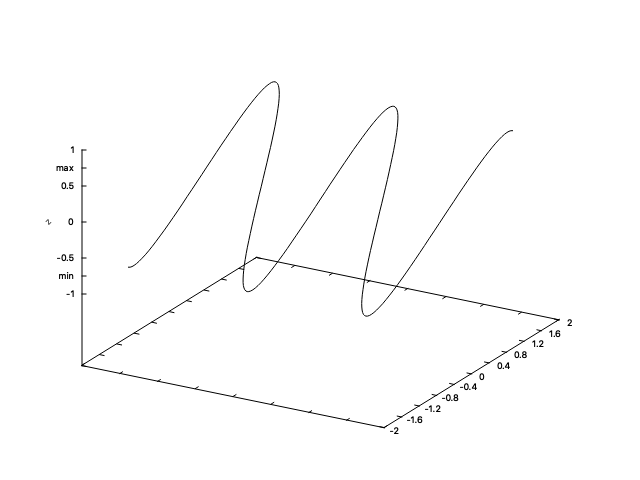

## 003 - Axis

This example shows how to handle `Axis` object in order to customise default axes.

`Axis` is a static attribute initialised after every `Gnuplot.Start()` or `Gnuplot.CleanData()`. The behaviour and methods are the
same regardless the chosen direction, i.e. X, Y or Z. 
Each `Axis` object has three main component:
* Range: It defines the axis span (the values to represent between a minimum and a maximum value). 
* Ticks: The marks (values) to represent over the axis.
* Label: The axis name or meaning.

Each `Axis` trait can be modified through the set method of the `Axis` class, e.g. `Gnuplot.Axis.SetXRange()` or `Gnuplot.Axis.SetYTicks()`.

To run the code of axis examples:

1. Go to the folder `Examples/003-Axis`

   ```shell
   (SharpPlot)$ cd Examples/003-Axis
   ```

2. The only thing you need to do now is running the project:

   ```shell
   (003-Axis)$ dotnet run
   Press any key + Enter to continue...
   ```

   And you'll get the following set of figures:
   
   
   
   
   
   
   
   The code that has produced the figures is the following:
   
   ```c#
   using System;
   using System.Collections.Generic;
   using System.Linq;
   using SharpPlot;
   using SharpPlot.Canvas.Figure;
   using SharpPlot.Utils;
   
   namespace Axis
   {
       public static class Program
       {
           static void Main(string[] args)
           {
               Gnuplot.Start();
               
               var x = Enumerable.Range(-100, 201).Select(z=>z*0.025*Math.PI).ToArray();
               var sinX = x.Select(Math.Sin).ToArray();
               var data = new DataPoints(x, sinX);
               
               var (id, fig) = Gnuplot.Plot<Line>(data, "sin(x)");
               
               Gnuplot.Axis.SetYRange(-2, 2);
               Gnuplot.Axis.SetXTicks(start:-4, step: 0.5, stop:4);
   
               Gnuplot.Axis.SetXLabel(label: "time [s]");
               Gnuplot.Axis.SetYLabel(label: "Amplitude [mm]", rotation: 90);
   
               Gnuplot.Show();
               Gnuplot.Wait();
               
               Gnuplot.CleanData();
               
               var (id2, fig2) = Gnuplot.Plot<Line>(data, "sin(x)");
               
               var additionalXTicks = new Dictionary<string, double>() { {"pi", Math.PI}, {"e", Math.E} };
               var additionalYTicks = new Dictionary<string, double>() { {"-pi", (-1)*Math.PI}, {"-e", (-1)*Math.E} };
               
               Gnuplot.Axis.SetXRange(0, 8);
               Gnuplot.Axis.AddTicks(labelValues: additionalXTicks, axis: 0);
               Gnuplot.Axis.SetYTicks(ticks: new List<double>(){-4,-2, -1, -0.5, -0.25, 0, 0.25, 0.5, 1, 2, 4});
               Gnuplot.Axis.AddTicks(labelValues: additionalYTicks, axis: 1);
               
               Gnuplot.Show();
               Gnuplot.Wait();
               
               Gnuplot.CleanData();
               
               var data3D = new DataPoints(x: x, y: sinX, z: sinX);
               Gnuplot.SetPlotType(PlotType.Splot);
               var (id3, fig3) = Gnuplot.Plot<Line>(data3D);
               Gnuplot.Axis.RemoveXTicks();
               Gnuplot.Axis.SetYTicks(start: -2, stop: 2, num: 11);
               Gnuplot.Axis.SetZRange(-1, 1);
               Gnuplot.Axis.SetZLabel(label: "z", rotation: 45);
               var additionalZTicks = new Dictionary<string, double>() { {"min", -0.75}, {"max", 0.75} };
               Gnuplot.Axis.AddTicks(additionalZTicks, axis: 2);
               
               Gnuplot.Show();
               Gnuplot.Wait();
           }
       }
   }
   ```
There are several things to understand from this example:
* The axis span can be set with `Gnuplot.Axis.SetXRange()`, `Gnuplot.Axis.SetYRange()` or `Gnuplot.Axis.SetZRange()`, where 
the minimum and maximum values are specified. By default, this method sets 5 ticks between both limits.
* In order to define axis span and ticks simultaneously, `Gnuplot.Axis.SetXTicks()`, `Gnuplot.Axis.SetYTicks()` or `Gnuplot.Axis.SetZTicks()` provide 
better handling. The ticks can be initialised as a custom-defined `IEnumerable<double>` or a fixed-length sequence (start-step-stop or start-stop-number).
* Additional ticks can be included using `Gnuplot.Axis.AddTicks()` method, whereas the entire axis ticks can be removed using `Gnuplot.Axis.RemoveXTicks()`,
`Gnuplot.Axis.RemoveYTicks()` or `Gnuplot.Axis.RemoveZTicks()`.   
* The axis label is added using `Gnuplot.Axis.SetXLabel()`, `Gnuplot.Axis.SetYLabel()` or `Gnuplot.Axis.SetZLabel()`. The rotation parameter configures 
the label orientation.
* A 3D figure can be plotted setting the plot type to `Splot` in `Gnuplot.SetPlotType()` method.      
  