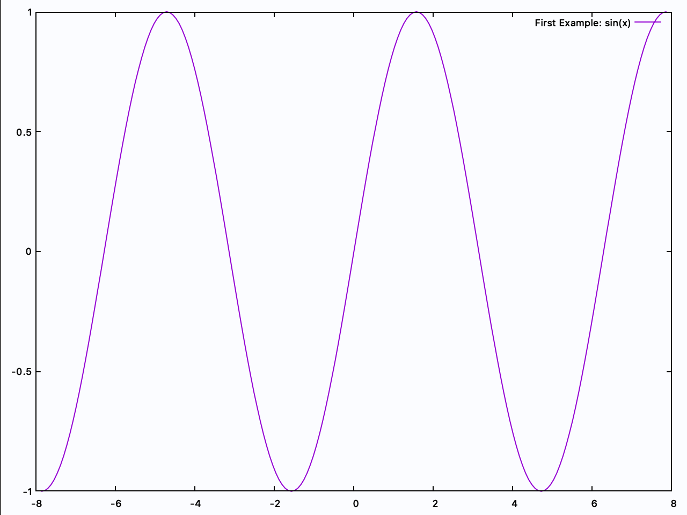

<p align="center">
  <a href="https://github.com/Qnubo-Tech/"></a>
</p>

# SharpPlot

[](https://github.com/Qnubo-Tech/SharpPlot/actions?query=workflow%3AUnitTests)
[](https://github.com/Qnubo-Tech/SharpPlot/blob/master/README.md)
[](https://opensource.org/licenses/BSD-3-Clause)
[](https://github.com/Qnubo-Tech/SharpPlot/blob/master/LICENSE.md)

[]()
[](https://github.com/Qnubo-Tech)

## Welcome

[\#Plot]() (so-called SharpPlot) is a class-library devoted to bring live graph representation capabilities to .Net. The library is a human-friendly wrapper for the widely-known GNUplot software. The fundamental idea behind this project is to bring to .NET core the easiness provided by other libraries in the Python's community, e.g., [MatPlotLib](https://matplotlib.org/). The library is provides the capability of live graph plots whilst running an executable solution, which is of fundamental importance in scientific and/or numerical software.

### Getting started

The library is available via [nuget](https://www.nuget.org/packages/SharpPlot/). Hence, the typical rules for installing a [nuget-package](https://docs.microsoft.com/en-us/nuget/consume-packages/install-use-packages-dotnet-cli) in your project/solution applies, i.e.:

```sh
> dotnet add package
```

However, for the sake of clarity, we provide a simple-project example in the next paragraph which will let you understand the standard way of interacting with the library.

### Simple project

Let's get started by creating a working directory (e.g., in our desktop):

```shell
(HOME)$ mkdir ~/Desktop/working-directory
(HOME)$ cd ~/Desktop/working-directory 
```

Now, let's create a simple console project inside:

```shell
(~/Desktop/working-directory)$ dotnet new console --output graph

The template "Console Application" was created successfully.
Processing post-creation actions...

Running 'dotnet restore' on graph/graph.csproj...
  Restore completed in 152.26 ms for /Users/YOURUSERNAME/Desktop/test-csharp/graph/graph.csproj.
Restore succeeded.
```

Now we're going to add the library to the project by utilising `dotnet SDK`:

```shell
(~/Desktop/working-directory)$ cd graph
(~/Desktop/working-directory)$ dotnet add package SharpPlot
```

Go and edit the `Program.cs` file you'll have in the folder you're at (supposedly `~/Destop/working-directory/graph/`) and edit it to get the following:

```c#
using System;
using System.Linq;
using SharpPlot;
using SharpPlot.Canvas.Figure;

namespace graph
{
    class Program
    {
        static void Main(string[] args)
        {
            Gnuplot.Start();
            var x = Enumerable.Range(-100, 201).Select(z=>z*0.025*Math.PI).ToArray();
            var sinX = x.Select(Math.Sin).ToArray();
            var data = new DataPoints(x, sinX);
            var (id, fig) = Gnuplot.Plot<Line>(data, "First Example: sin(x)");
            Gnuplot.Show();
            Gnuplot.Wait();
        }
    }
}
```

Save the file, and run the following command in the terminal:

```shell
(~/Desktop/working-directory/graph)$ dotnet run
Press any key + Enter to continue...
```

and you should get your first floating graph example with [#Plot](), congratulations!



## Requirements

[#Plot]() is a wrapper of [gnuplot](http://www.gnuplot.info/), which is why we list it as one of the main dependencies. You only need to have it installed in your OS, and [#Plot]() will know where to look for it. Therefore, the list of main dependencies is as follows:

* [Gnuplot](http://www.gnuplot.info/)
* [MathNet.Numerics](https://www.nuget.org/packages/MathNet.Numerics/) (>= 4.9.0)

## Main features

We think the best way to learn is by example and documentation. For this reason, we have prepared a set of examples which are enclosed in a different solution under the [Examples](Examples) folder. There you will find different small projects that will help you understand the use of [#Plot]():

* [001-GettingStarted](Examples/001-GettingStarted): The example we have followed in the previous section, with a little README file, and a Jupyter notebook!
* [002-FigureProperties](Examples/002-FigureProperties): An introduction to the properties that can be modified for each Figure.
* [003-Axis](Examples/003-Axis): How to customise the Axis range, ticks and labels.

## Authors

* [Antonio Malpica](https://github.com/NonoMalpi)
* [Miguel A. Durán-Olivencia](https://github.com/migduroli)
* [Pedro Morales](https://github.com/partmor)
* [Francisco J. Durán-Olivencia](https://github.com/fjduranolivencia/)

## Contributing

To have a better understanding on how to make contributions, please read the [CONTRIBUTING](CONTRIBUTING.md) file. Our style of code adheres to Google's standards ([google-styleguide](https://google.github.io/styleguide/csharp-style.html)). We want to keep the source consistent, readable and easy to merge. For this reason we use rigid coding style and we expect all contributors to conform this guidelines. Please, use [.clang-format](.clang-format) to check your formatting. 

## License

This project is licensed under the **3-Clause BSD License** - see the [LICENSE](LICENSE.md) file for details.
