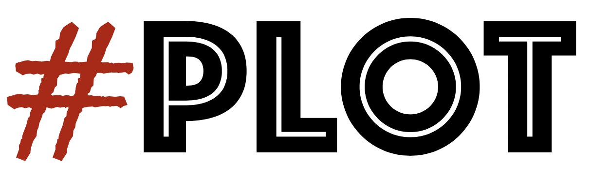
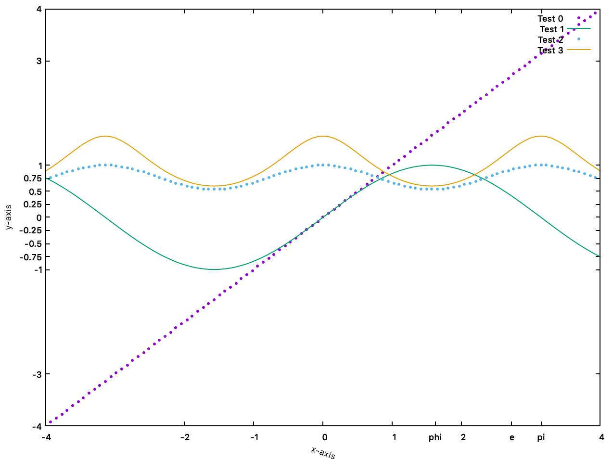
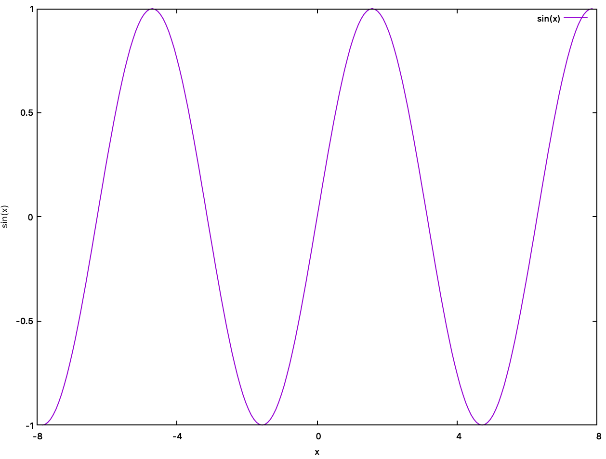

<p align="center">
  <a href="https://github.com/Qnubo-Tech/"></a>
</p>

# SharpPlot

[](https://github.com/Qnubo-Tech/SharpPlot/actions?query=workflow%3AUnitTests)
[](https://github.com/Qnubo-Tech/SharpPlot/blob/master/README.md)
[](https://www.gnu.org/licenses/gpl-3.0)
[](https://github.com/Qnubo-Tech/SharpPlot/blob/master/LICENSE.md)


[]()
[](https://github.com/Qnubo-Tech)

## Welcome

SharpPlot is currently at the very beginning of the development cycle and aims to bring a proper wrapper of 
GNUPlot into **C#**. The fundamental idea behind this project is to bring to .NET core the easiness provided by other 
libraries in the Python's community, e.g. [MatPlotLib](https://matplotlib.org/).

### Getting started

(TBC)

## Requirements

* [Gnuplot](http://www.gnuplot.info/)

## Main features

(TBC)

### Examples

```csharp
static void Main(string[] args)
{
        Gnuplot.Start(filePath: "/usr/local/bin/gnuplot");
        var x = Enumerable.Range(-100, 201).Select(z=>z*0.025*Math.PI).ToArray();
       
        var sinX = x.Select(Math.Sin).ToArray();
        var sincosX = sinX.Select(Math.Cos).ToArray();
        var sincostanX = sincosX.Select(Math.Tan).ToArray();
        
        // Gnuplot Example 1:
        Gnuplot.PlotScatter(x, x, "Test 0");
        Gnuplot.PlotLine2D(x, sinX, "Test 1");
        Gnuplot.PlotScatter(x, sincosX, "Test 2");
        Gnuplot.PlotLine2D(x, sincostanX, "Test 3");
        
        Gnuplot.Axis.SetXTicks(new List<double>(){-4,-2, -1, 0, 1, 2, 4});
        Gnuplot.Axis.SetYTicks(new List<double>(){-4, -3, -1, -0.75, -0.5, -0.25, 0, 0.25, 0.5, 0.75, 1, 3, 4});
        var xticks = new Dictionary<string, double>() { {"pi", Math.PI}, {"phi", 1.618}, {"e", Math.E}};
        Gnuplot.Axis.AddTicks(labelValues: xticks, axis: 0);
        Gnuplot.Axis.SetXLabel(label: "x-axis", rotation: -20);
        Gnuplot.Axis.SetYLabel(label: "y-axis");
        
        Gnuplot.Show();
        Gnuplot.Wait();

        // Gnuplot Example 2:
        Gnuplot.CleanData();
        
        Gnuplot.Axis.SetXRange(-8, 8);
        Gnuplot.Axis.SetYRange(-1, 1);
        Gnuplot.Axis.SetXLabel("x");
        Gnuplot.Axis.SetYLabel("sin(x)");
        
        Gnuplot.PlotLine2D(x, sinX, "sin(x)");
        
        Gnuplot.Show(); 
        Gnuplot.Wait();
        
        Gnuplot.Exit();
}
```
Result:
<p align="center">
  
</p>

<p align="center">
  
</p>

## Platforms

(TBC)

## Authors

(TBC)

## Contributing

(TBC)

## License

(TBC)
